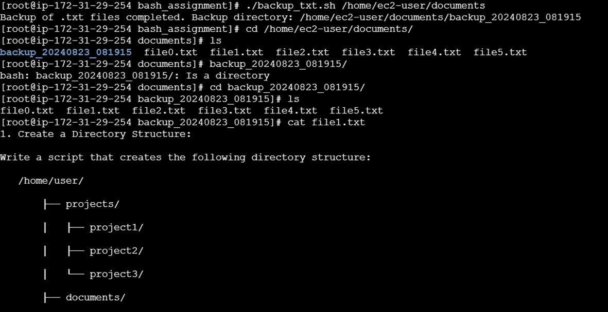

#### Task2>> File Backups: Write a script that takes a directory as an argument and creates a backup of all `.txt` files in that directory. The backup files should be copied to a new directory named `backup` with a timestamp.

##### Bash script that takes a directory as an argument, creates a backup of all `.txt` files from that directory, and places the backup files into a new directory named `backup` with a timestamp:

```bash
#!/bin/bash

# Check if directory argument is provided
if [ "$#" -ne 1 ]; then
    echo "Usage: $0 <directory>"
    exit 1
fi

# Assign argument to directory variable
src_dir="$1"

# Check if the provided argument is a directory
if [ ! -d "$src_dir" ]; then
    echo "Error: '$src_dir' is not a directory."
    exit 1
fi

# Create a timestamp for the backup directory
timestamp=$(date +"%Y%m%d_%H%M%S")
backup_dir="${src_dir}/backup_${timestamp}"

# Create the backup directory
mkdir -p "$backup_dir"

# Find and copy .txt files to the backup directory
find "$src_dir" -maxdepth 1 -type f -name "*.txt" -exec cp {} "$backup_dir" \;

echo "Backup of .txt files completed. Backup directory: $backup_dir"
```
### Output


### How it works:
1. **Check Argument**: The script checks if exactly one argument is provided and whether it's a valid directory.
2. **Create Timestamp**: It generates a timestamp for naming the backup directory.
3. **Create Backup Directory**: The `mkdir -p` command creates the backup directory.
4. **Copy `.txt` Files**: The `find` command locates `.txt` files in the specified directory (not recursively) and copies them to the backup directory.

### Usage:
Save this script as `backup_txt.sh`, make it executable with `chmod +x backup_txt.sh`, and run it with:

```bash
./backup_txt.sh /home/ec2-user/documents
```

This will create a backup of all `.txt` files in `/home/ec2-user/documents` and place them in a new `backup` directory with a timestamp.
