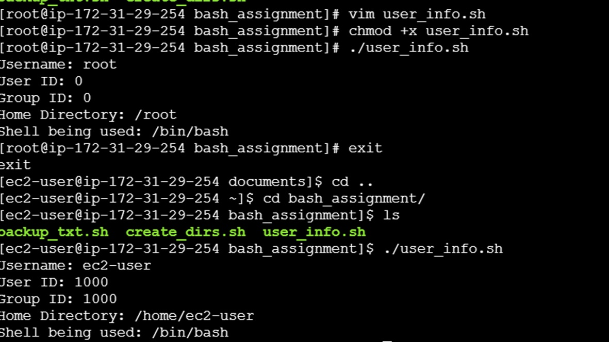

### Task3>> Write a script that displays the following information about the user:   -Username   -User ID -Group ID -Home Directory   - Shell being used

##### Bash script to get the user details is as below:

```bash
#!/bin/bash

# Get user information
username=$(whoami)
user_id=$(id -u)
group_id=$(id -g)
home_directory=$(eval echo ~$username)
shell=$(getent passwd "$username" | cut -d: -f7)

# Display user information
echo "Username: $username"
echo "User ID: $user_id"
echo "Group ID: $group_id"
echo "Home Directory: $home_directory"
echo "Shell being used: $shell"
```

### Output:



### How it works:
1. **Username**: The `whoami` command is used to get the current logged-in username.
2. **User ID**: The `id -u` command retrieves the user ID.
3. **Group ID**: The `id -g` command retrieves the group ID.
4. **Home Directory**: `eval echo ~$username` expands to the home directory of the user.
5. **Shell**: The `getent passwd "$username" | cut -d: -f7` command retrieves the user's shell from the `/etc/passwd` file.

### Usage:
Save the script as `user_info.sh`, make it executable with `chmod +x user_info.sh`, and run it with:

```bash
./user_info.sh
```

This script will output the username, user ID, group ID, home directory, and the shell being used.
