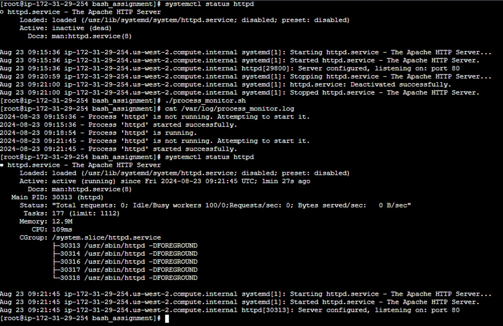

## Task7>> Process Monitor: Write a script that checks if a specific process (e.g., apache2) is running. If the process is not running, the script should start the process and log the action to a file.

### Bash script that checks if a specific process (e.g., `apache2`) is running. If the process is not running, the script starts it and logs the action to a file.

### Script:

```bash
#!/bin/bash

# Define the process to monitor and the log file
process_name="apache2"
log_file="/var/log/process_monitor.log"

# Function to log messages
log_message() {
    local message="$1"
    echo "$(date +"%Y-%m-%d %H:%M:%S") - $message" >> "$log_file"
}

# Check if the process is running
if pgrep "$process_name" > /dev/null; then
    log_message "Process '$process_name' is running."
else
    log_message "Process '$process_name' is not running. Attempting to start it."

    # Start the process (adjust the command if needed)
    if systemctl start "$process_name"; then
        log_message "Process '$process_name' started successfully."
    else
        log_message "Failed to start process '$process_name'."
    fi
fi
```
### Output

### How it works:
1. **Define Process and Log File**: Sets the name of the process to check and the path to the log file.
2. **Log Function**: `log_message` writes timestamped log messages to the specified log file.
3. **Check Process**: Uses `pgrep` to check if the process is running. If the process is not running, it attempts to start it using `systemctl` and logs the action.
4. **Start Process**: Uses `systemctl start` to start the process and logs success or failure.

### Usage:
1. **Save the Script**: Save the script as `process_monitor.sh`.
2. **Make it Executable**: Run `chmod +x /path/to/process_monitor.sh` to make the script executable.
3. **Run the Script**: Execute the script manually with:

    ```bash
    ./process_monitor.sh
    ```

### Scheduling with Cron:
To run this script periodically, e.g., every 5 minutes, add it to your crontab:

1. **Edit Crontab**: Open your crontab for editing with `crontab -e`.
2. **Add Cron Job**: Add the following line:

    ```bash
    */5 * * * * /path/to/process_monitor.sh
    ```

    Adjust the path to where you saved the script. This will execute the script every 5 minutes, ensuring that the specified process is monitored and restarted if necessary.
