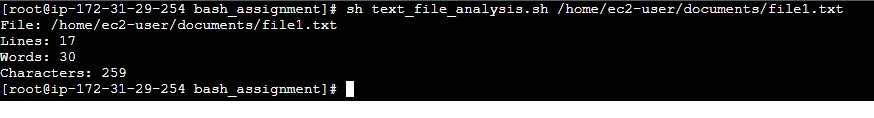

#### Task8>> Text File Analysis: Write a script that takes a text file as an argument and counts the number of lines, words, and characters in the file. The script should display the counts.

##### Bash script that takes a text file as an argument and counts the number of lines, words, and characters in the file. The script will then display these counts.

### Script:

```bash
#!/bin/bash

# Check if a file argument is provided
if [ "$#" -ne 1 ]; then
    echo "Usage: $0 <file>"
    exit 1
fi

# Assign the argument to a variable
file="$1"

# Check if the file exists
if [ ! -f "$file" ]; then
    echo "Error: File '$file' does not exist."
    exit 1
fi

# Count lines, words, and characters
line_count=$(wc -l < "$file")
word_count=$(wc -w < "$file")
char_count=$(wc -m < "$file")

# Display the counts
echo "File: $file"
echo "Lines: $line_count"
echo "Words: $word_count"
echo "Characters: $char_count"
```
### Output:


### How it works:
1. **Check Argument**: The script checks if exactly one argument (the file) is provided.
2. **File Existence**: It verifies if the specified file exists and is a regular file.
3. **Count Lines, Words, and Characters**:
   - `wc -l < "$file"` counts the number of lines.
   - `wc -w < "$file"` counts the number of words.
   - `wc -m < "$file"` counts the number of characters.
4. **Display Counts**: Outputs the file name and the counts for lines, words, and characters.

### Usage:
Save the script as `text_file_analysis.sh`, make it executable with `chmod +x text_file_analysis.sh`, and run it with:

```bash
./text_file_analysis.sh /path/to/your/textfile.txt
```

This will count and display the number of lines, words, and characters in the specified text file.
